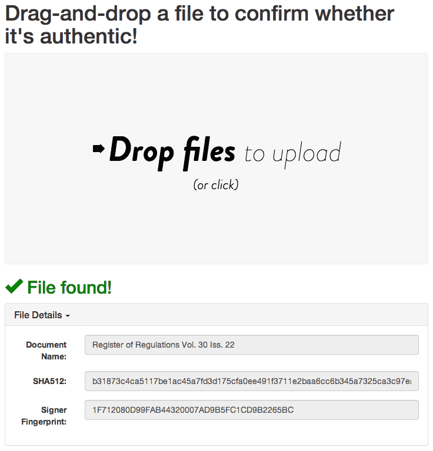



Data Seal is free, open source software that allows data published by governments to be authenticated by end users with a simple, drag-and-drop interface. It was created for the purpose of helping governments to comply with the [Uniform Electronic Legal Materials Act](http://www.aallnet.org/documents/government-relations/uelma).

## Verification Process

It looks like this:

## Download

[Data Seal is available on GitHub](https://github.com/unitedstates/data-seal/).

## Vendors

Paid Data Seal hosting is available from [Silicon Valley Software Group](https://dataseal.svsg.co/).
